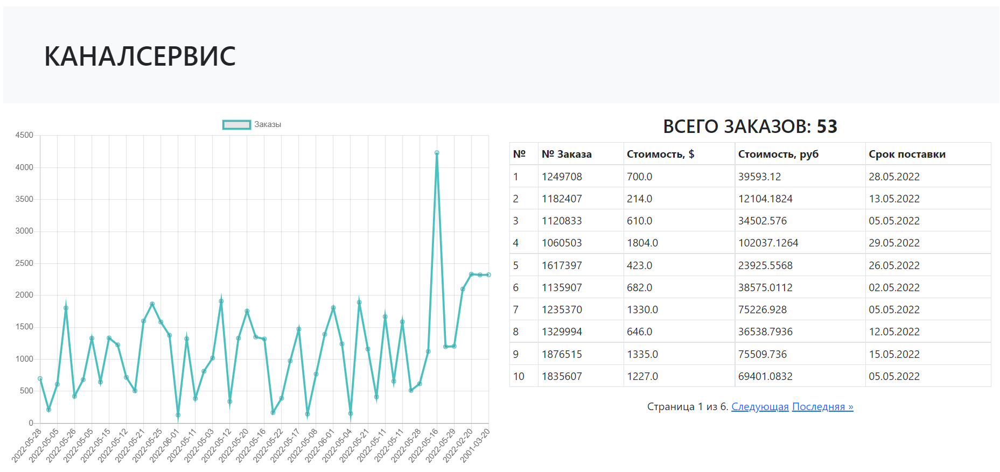

# Тестовая задача

------------------------------------------------------------------------    

Ссылка на google-таблицу - [Google таблица](https://docs.google.com/spreadsheets/d/1cZpLMr5_Sy8OIKXkFzetfetjf-RA6Stq6k3II0fD2P4)

Инструкция по запуску скрипта:

    $ mkdir somedir/

    $ cd somedir

    $ git clone https://github.com/alexgreyshark/test-channel-service.git

    $ cd test-channel-service/test_channel_project

    $ docker-compose up -d

    $ docker-compose exec web python manage.py migrate

Далее открыть http://localhost:8000/

